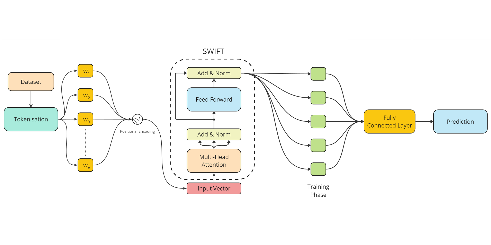
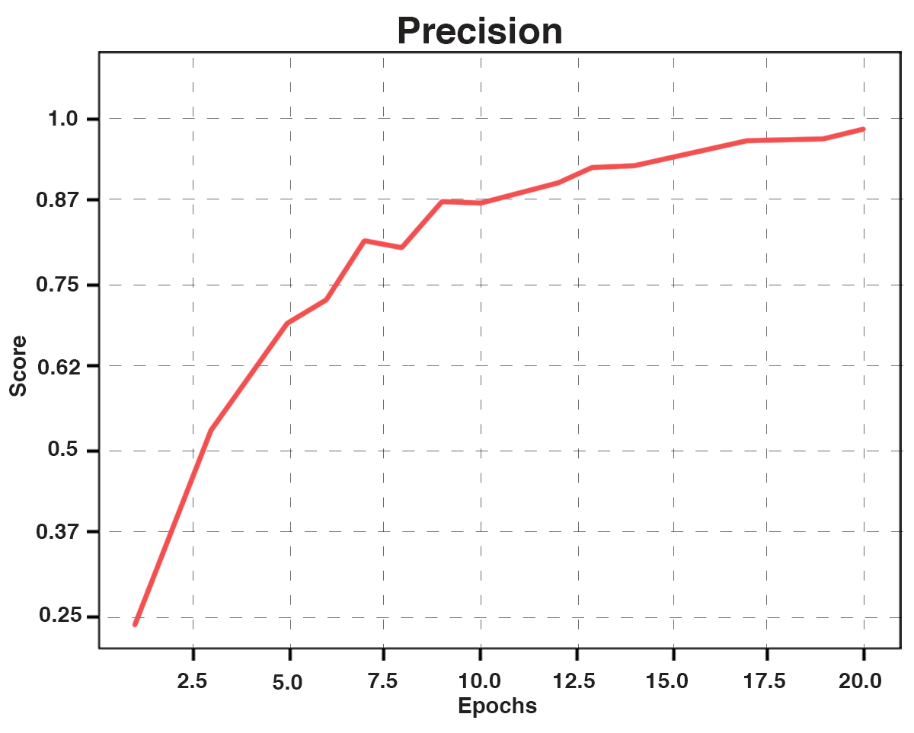

# Abstract
In the current era of online publication, the publication rate of online news articles has grown exponentially. The classification of news articles is crucial for easier comprehension of online content. Without proper categorization, readers often struggle to navigate through the vast amounts of news available to them. This paper is devoted to the single-label semantic classification on the combined dataset of BBC All Time and Reuters News. We conducted comparative analyses between SWIFT and established models such as BERT, alBERT, and DistilBERT. Our experiments demonstrate that SWIFT surpasses these generic models on our English News Dataset, yielding superior classification performance, particularly in the categorization of news titles. Comparison with the state-of-the-art research shows we can consider SWIFT as a baseline for future investigations of analysis of news datasets.

*Fig. 1: Proposed Methodology Architecture*

## Introduction
Topical news classification involves categorizing news articles into thematic classes. A key aspect of this task is single-label news classification, which has seen various solutions using standard text features and deep learning techniques. However, these methods often have huge variations in results across different languages and datasets, and applications limiting their generalized use.

Recently, the BERT language model has emerged as a promising approach capable of achieving high-quality results across various semantic text processing tasks, including news classification. BERT has demonstrated its effectiveness in analyzing English news across diverse datasets. While much attention has been given to BERT's performance in English news analysis, there is still a need for further enhancing its capabilities across different datasets and tasks.

The paper follows a structured approach. In Section I, we look into the current literature on topical classification, exploring methodologies employing BERT alongside other prevalent text features. Section II outlines our research methodology, the tailored text dataset, feature extraction techniques, and experimental design.

In Section III, we present the outcomes of the experiments conducted with varied text models. Finally, in Section IV the comparative results across the proposed and existing models summarize the key findings of our study and suggest avenues for future exploration.

### Related Work
News classification, a fundamental task in Natural Language Processing (NLP), involves assigning labels or classes to text based on its content.It begins with a dataset where class assignments are known, and the aim is to correctly predict the target class (i.e., category) for each news item. Unlike regular texts, news articles are continuously generated, making their categorization challenging. However, this classification facilitates easier access and navigation through a diverse range of articles in real time for users. Machine learning is the primary approach for implementing news classification, with supervised learning models such as Naïve Bayes Classifier, K-Nearest Neighbors, and Support Vector Machines being commonly utilized. While these methods offer basic accuracy, the complexity arises when a news article may belong to more than one category, necessitating careful consideration. Techniques like Hierarchical Multilabel Classification, Semi-supervised learning, Bayesian Networks, and clustering algorithms have been employed to address such challenges.

## Comparison with Models
BERT, ALBERT, and DistilBERT are among the latest advancements in pre-trained language models, pioneered by researchers at Google and Hugging Face, respectively. ([Devlin et al., 2018](https://arxiv.org/abs/1810.04805), [Lan et al., 2020](https://arxiv.org/abs/1909.11942), [Sanh et al., 2019](https://arxiv.org/abs/1910.01108)).

BERT, introduced by Devlin et al. (2018), revolutionized the field with its bidirectional contextualized embeddings, allowing it to capture deeper semantic understanding. ALBERT, proposed by Lan et al. (2020), builds upon BERT's success by implementing parameter-efficient model architecture improvements, resulting in faster training and smaller memory footprint. DistilBERT, as presented by Sanh et al. (2019), distills BERT's knowledge into a smaller model size by using a teacher-student framework, achieving significant reduction in computational resources while maintaining competitive performance.

*Fig. 2: Validation Loss and Accuracy*

*Fig. 3: Precision*

*Fig. 4: Recall*

*Fig. 5: F1 Score*

We conducted comparative evaluations using BERT, ALBERT, and DistilBERT, along with SWIFT, on a standard news classification dataset. Despite the advancements in these pre-trained models, SWIFT outperforms them significantly in news classification tasks.

| Classifier | Authors | Accuracy | Val. Loss | Recall | Precision | F1 Score |
|------------|---------|----------|-----------|--------|-----------|----------|
| BERT       | Devlin et al. (2018) | 88.73% | 0.6 | 56.9 | 57.1 | 56.3 |
| ALBERT     | Lan et al. (2020)     | 92.23% | 0.3 | 96.1 | 95.4 | 95.7 |
| DistilBERT | Sanh et al. (2019)    | 94.23% | 0.4 | 94.3 | 93.9 | 94.0 |
| **SWIFT**  | -                       | **96.19%** | **0.2** | **98.9** | **98.5** | **98.6** |

*Fig. 6: Precision Comparative Graph*

*Fig. 7: Recall Comparative Graph*

*Fig. 8: F1 Score Comparative Graph*

*Fig. 9: Accuracy Comparative Graph*

## Discussion
SWIFT manages to perform exceedingly well on the combined dataset. This will be useful for English News Classification and Semantic Understanding. Approaches used in this paper can also be selectively employed in other areas where Text Classifications come in handy. With the advent of artificial intelligence as it has in the past few years, there is truly very little that cannot be achieved.

## Conclusion and Future Work
Text Classification is a significant problem in Deep Learning ([Yang et al., 2022](https://doi.org/10.1145/3495162)), further extending to Natural Language Processing, Semantic Understanding and Large Language Models. SWIFT succeeds in overcoming many obstacles such as Semantic understanding, increased accuracy and quantization through a streamlined approach. Converting the problem to an autoregressive approach, it is followed by bidirectional context and dependency identification as features. These are further used to determine loss, accuracy, recall, precision and F1 scores. SWIFT, therefore, achieves a standout 96.19% and 0.2% Accuracy and validation Loss.

While SWIFT successfully implements a novel approach in News Classification, there will be a need for hyperparameter tuning when it is applied on different single or multi-language datasets. The final merged dataset will require fine-tuning in the model architecture as well because datasets with generally more parameters per topic will require some downsizing of the structure to make SWIFT computationally more viable on larger datasets.
